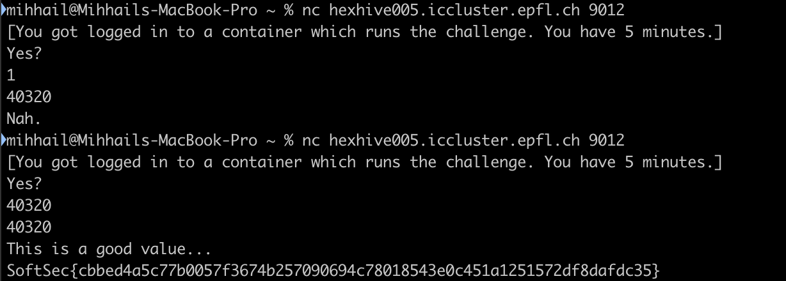

# Writeup
Author: Mihhail Sokolov (msokolov)
SCIPER: 338760

## My head explodes chalenge
After opening the executable in Ghidra, looking at the decompiled functions, and some renaming of the functions and variables, we arrive at the following "main" code:

As can be seen from the code, in order to get the flag printed we need to enter the value and it should match with the value generated by another function.

So let's see how that value is being generated. After a little big of renaming we arrive at the following code:

Luckily for us the generated value is being printed. We can also see that other functions are also being called inside the loop operating on the `generated_value`, however if we go down the function call chain, we see that there is no random variables. This means that `generated_value` is deterministic and always has the same value.
In the end, all we need to do to get the flag is to run the program twice: first time to enter wrong value and find out the correct generated value and second time to actually enter the correct generated value and get the flag. This procedure can be seen in the screenshot below.
